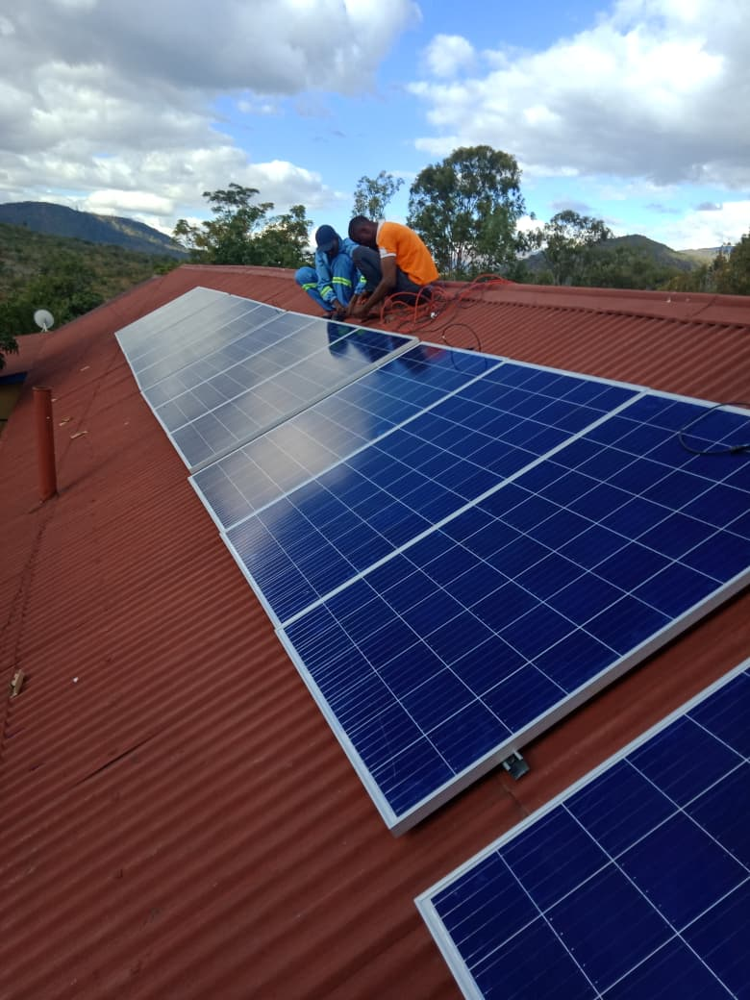
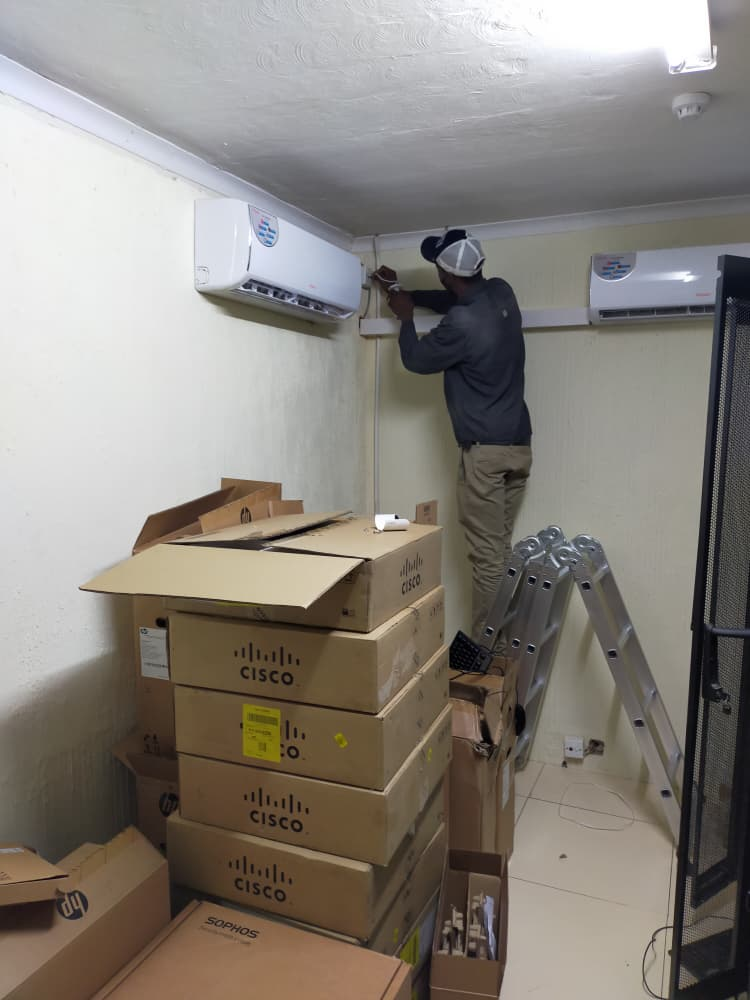
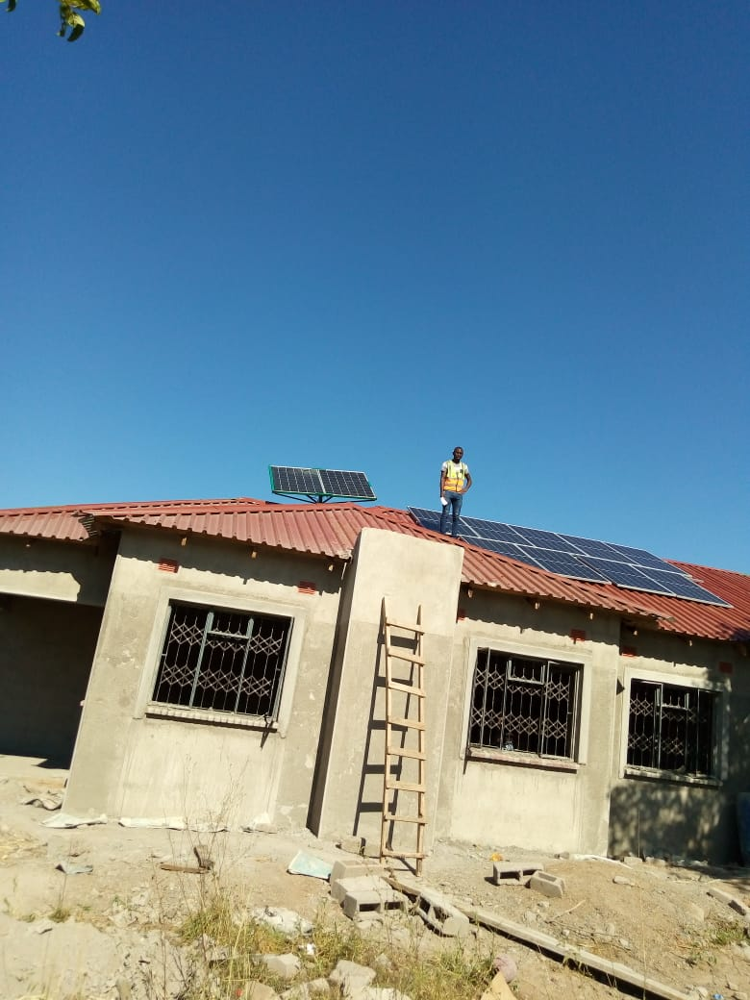
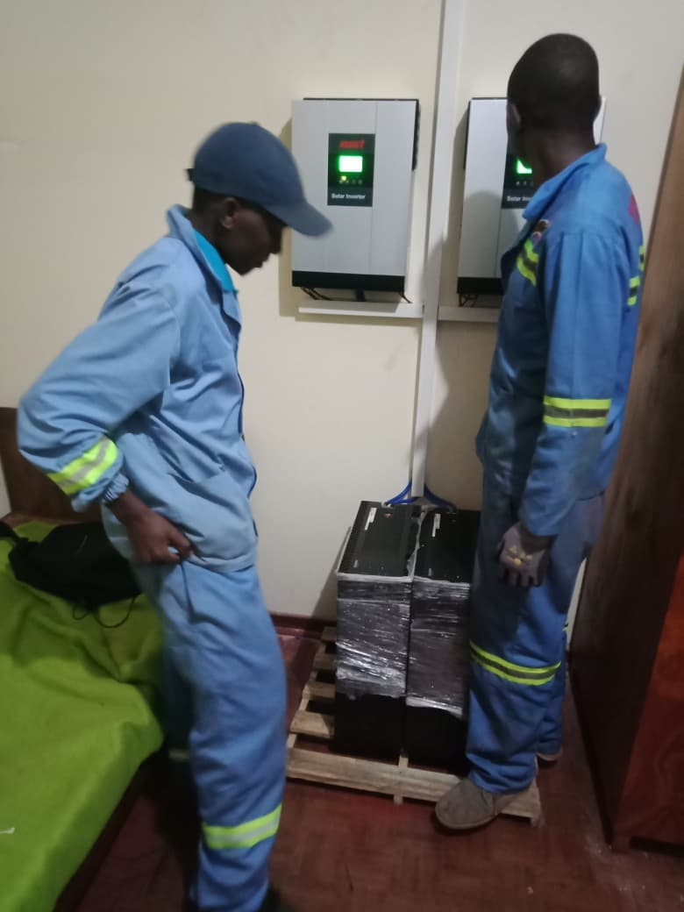

🌞 Solar PV & Battery Storage Commissioning Portfolio
Professional Engineering Documentation — Residential & Institutional Systems  

This portfolio showcases hands‑on technical work in decentralized solar photovoltaic (PV) systems, hybrid inverter configuration, battery energy storage systems (BESS), and electrical protection commissioning. It includes structural layouts, wiring schematics, safety integration, and visual proof of completed installations.

🧰 Core Technical Competencies
1. DC & AC Power Electronics
Hybrid & grid‑tied inverter installation

Parameter configuration for DC‑AC conversion

String layout engineering

Voltage balancing for domestic and institutional arrays

2. Battery Energy Storage Systems (BESS)
Lithium‑ion & deep‑cycle battery bank installation

Terminal torqueing & containment safety

Charge controller & BMS calibration

Charge/discharge profile programming

3. Electrical Protection & Grounding
DC isolators, AC SPDs, high‑voltage fuses

Ground rod installation & bonding

Lightning mitigation & operator safety

System isolation and commissioning checks

🏠 Project Categories
Residential Systems
Rooftop PV arrays

Hybrid inverter setups

Consumer board rewiring

Domestic battery storage integration

Institutional Systems
School PV installations

Multi‑string array configuration

High‑capacity inverter commissioning

Safety protection for large‑scale systems

📸 Project Gallery
10KVA System Installation

Boarding School PV Installation

Domestic 3‑Phase Solar Wiring

Consumer Board Wiring — Before
.jpeg)

Consumer Board Wiring — After
.jpeg)

Domestic PV Installation

Inverter Configuration

Private School PV Installation

Air Conditioner Maintenance

Domestic Solar Installation

Roof PV Installation

Solar Inverter Configuration

