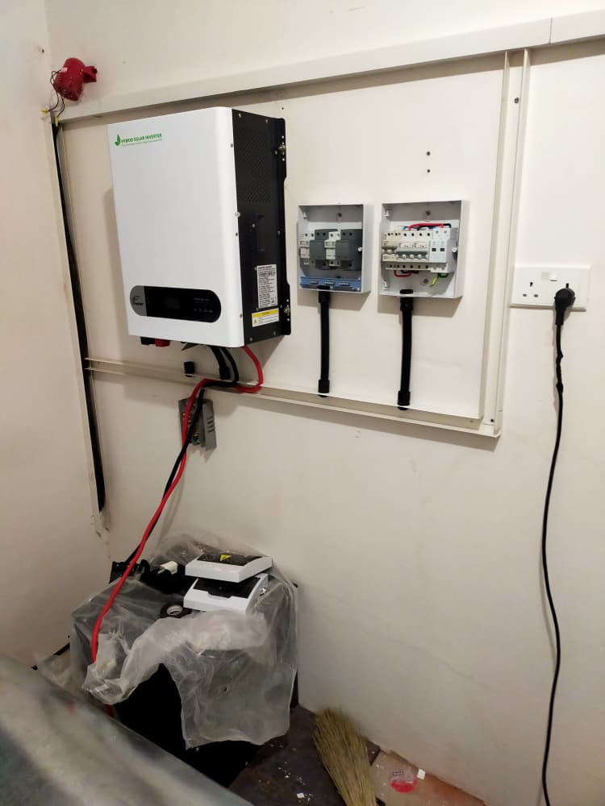
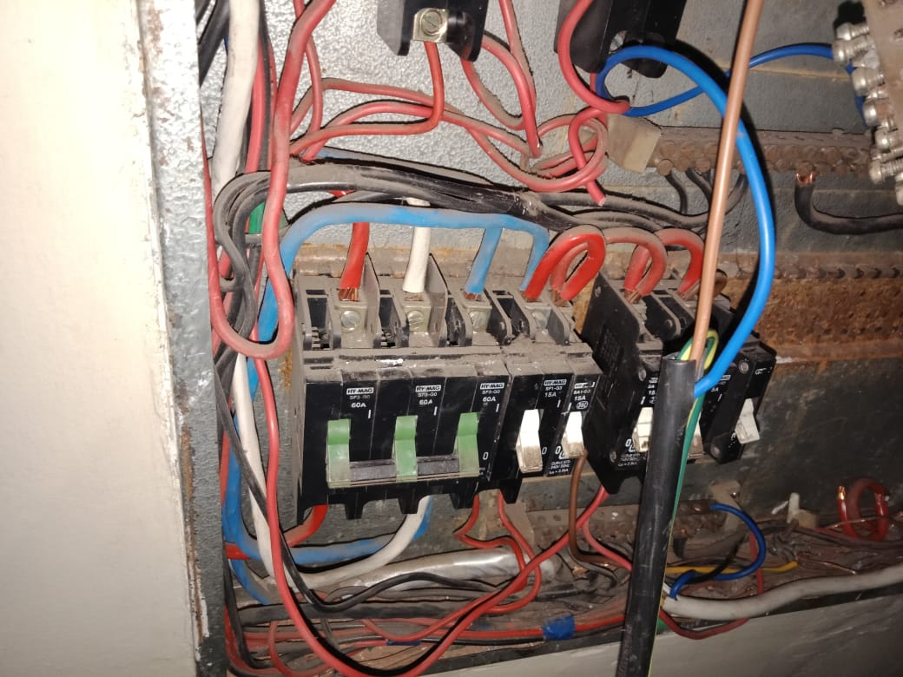
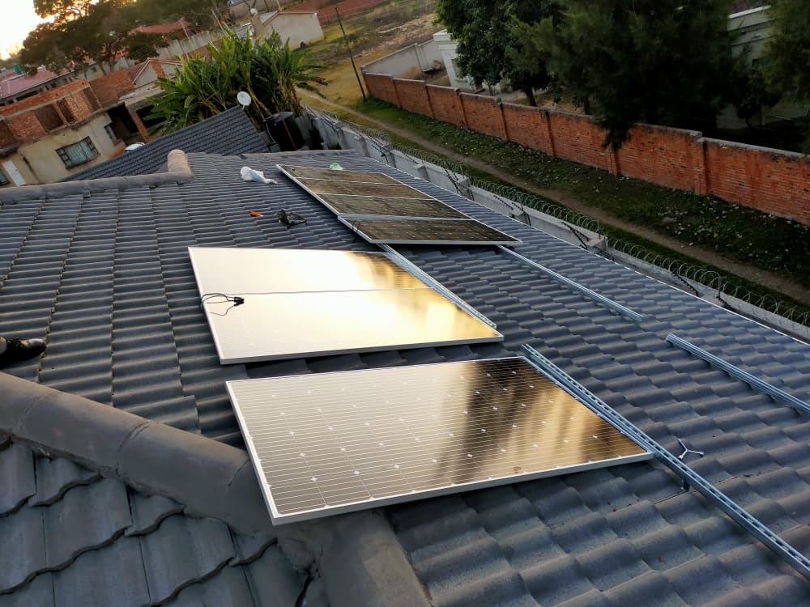
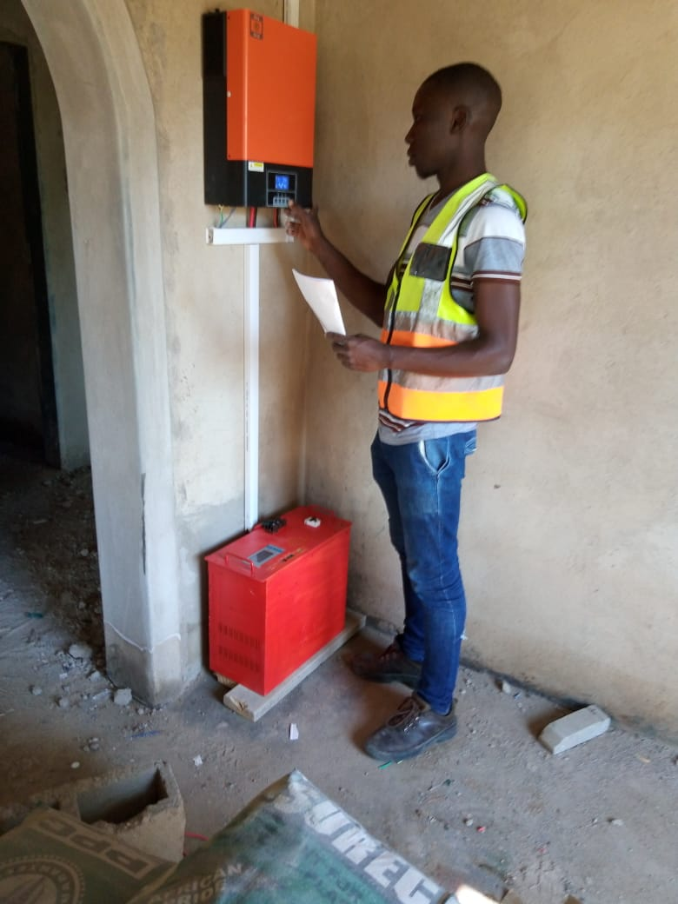
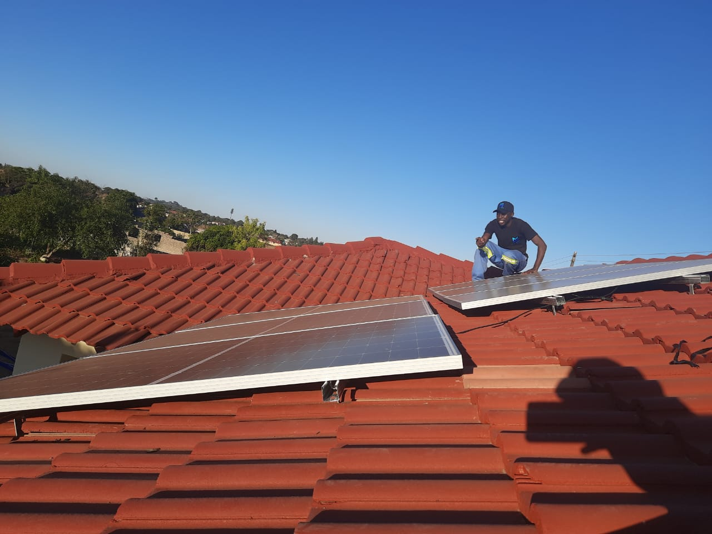

<h1 align="center">⚡ Solar PV & Battery Storage Commissioning Portfolio ⚡</h1>

<h3 align="center">
🛠️ Renewable Energy Technician &nbsp;•&nbsp; ⚙️ Power Systems Engineering &nbsp;•&nbsp; 🔋 BESS Integration &nbsp;•&nbsp; 🌞 PV Design & Commissioning
</h3>

---

# Solar PV & Battery Storage Commissioning Portfolio

This portfolio documents hands-on engineering work in decentralized solar photovoltaic (PV) systems, hybrid inverter configuration, battery energy storage systems (BESS), and electrical protection commissioning. It includes structural layouts, wiring schematics, safety integration, and visual proof of completed installations.

## Core Technical Competencies

### ⚙️ DC & AC Power Electronics
- Hybrid and grid-tied inverter installation  
- Parameter configuration for DC–AC conversion  
- String layout engineering and voltage balancing  

### 🔋 Battery Energy Storage Systems (BESS)
- Lithium-ion and deep-cycle battery bank installation  
- Terminal torqueing and containment safety  
- Charge controller and BMS calibration  

### ⚡ Electrical Protection & Grounding
- DC isolators, AC SPDs, and high-voltage fuses  
- Ground rod installation and bonding  
- Lightning mitigation and operator safety  

---

# 📸 Project Gallery

### 10KVA System Installation

### Boarding School PV Installation

### Domestic 3-Phase Solar Wiring

### Consumer Board Wiring — Before

### Consumer Board Wiring — After

### Domestic PV Installation

### Inverter Configuration

### Private School PV Installation

### Air Conditioner Maintenance

### Domestic Solar Installation

### Roof PV Installation

### Solar Inverter Configuration

---

# 🔧 Commissioning Workflow

1. Site assessment and load profiling  
2. PV array structural mounting  
3. String calculations and voltage balancing  
4. Inverter installation and parameter setup  
5. Battery bank wiring and BMS configuration  
6. Protection device installation (DC/AC)  
7. Grounding and lightning mitigation  
8. System testing and safety verification  
9. Performance monitoring and client handover  

---

